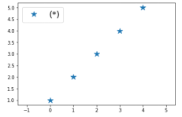
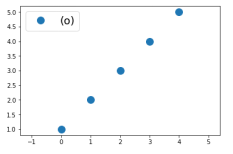
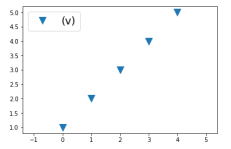
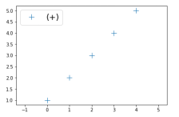
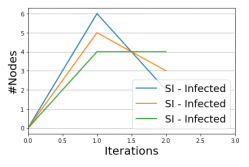
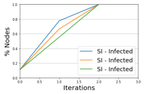
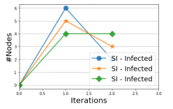
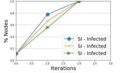

# Ndlib_Marker_Viz
## Adding a Marker To Ndlib Graph Viz

Adding marker to Ndlib ComparisonViz and DiffusionViz to distinguish multiple lines and improve visual understanding.

NDlib is a Python software package that allows to describe, simulate, and study diffusion processes on complex networks. The package was design and documentation by GiulioRossetti you can find examples, tutorials and a complete reference here [ndlib](https://github.com/GiulioRossetti/ndlib).


Matplotlib Marker: a basic matplotlib Marker plot, this shows a few optional features, like defining legend labels, legend size and maker size.
```python
#Code to plot a simple demo with a “*” marker.
 
import matplotlib.pyplot as plt
x = [1,2,3,4,5]
fig, ax = plt.subplots()
ax.plot(x, '*' , markersize=12, label='(*)')
ax.axis('equal')
leg = ax.legend(fontsize=12);
```
Below are some basic example plots for markers (‘*’, ‘o’ , ’v’ , ‘+’) respectively.






## Assign a unique markers for each plot

Form [Solution 4](hhttps://stackoverflow.com/questions/13091649/unique-plot-marker-for-each-plot-in-matplotlib)in stackoverflow, which answer the quastion of how to us unique markers for each plot in matplotlib. the solution uses ‘itertools.cycle’ to iterate over a list or tuple indefinitely which picks markers randomly for you. The answer shown blow. 

Python 2.x

```python
import itertools
marker = itertools.cycle((',', '+', '.', 'o', '*')) for n in y:
    plt.plot(x,n, marker = marker.next(), linestyle='')
```
Python 3.x

```python
import itertools
marker = itertools.cycle((',', '+', '.', 'o', '*')) for n in y:
plt.plot(x,n, marker = next(marker), linestyle='')
```

To find the set of All possible markers you can visit matplotlib.markers[2] in matplotlib website (https://matplotlib.org/3.1.0/api/markers_api.html).

## Ndlib Graph Viz
From the documentation of Ndlib, it shown that the model uses matplotlib and bakeh to visualize the diffusion/spreading process and did a good job but Adding markers to a line can be a useful way to distinguish multiple lines or to highlight particular data points. So above solution to add unique markers to all lines.
Instead of visualizing the diffusion process like this:




It can be visualize like this:




## Ndlib Marker 
To Add markers to your visualization clone or download this repository. then replace the two python original DiffusionViz.py and ComparisonViz.py with the ones in this repository, I just add three line of code but everything else in the code is thesame as the original files.
